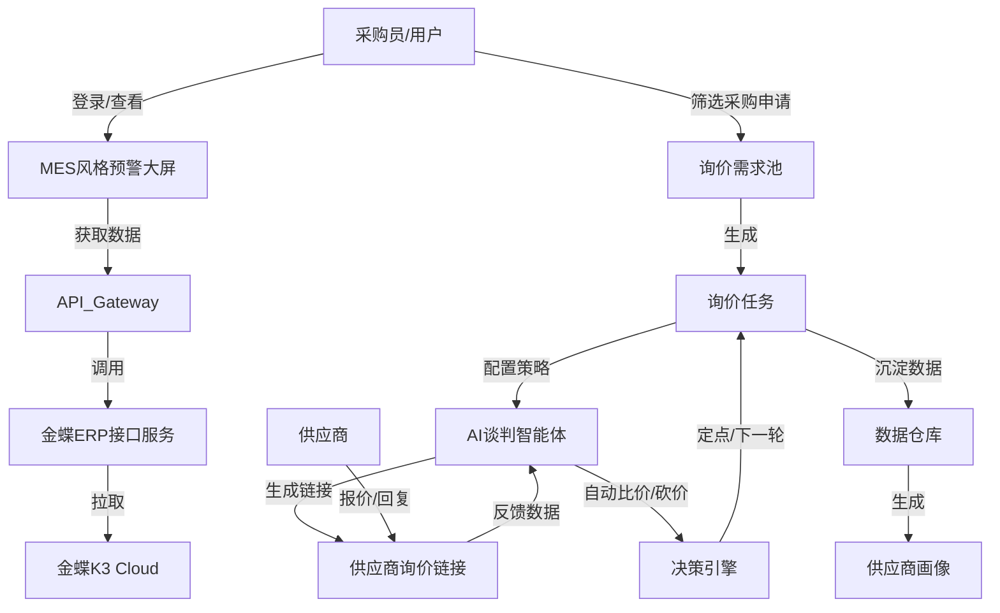

# 供应链智能体 (Supply Chain Agent) 系统设计文档

## 1. 项目概述

本项目旨在构建一个基于 AI 的供应链智能体系统，集成现有的金蝶 ERP 数据接口，提供**智能化预警大屏**和**自动化询价谈判**两大核心功能。系统将通过数据可视化技术展示实时的供应链风险，并通过自动化流程简化采购询价、比价及供应商管理过程，体现 AI 在供应链管理中的决策辅助与执行能力。

## 2. 系统架构

系统采用前后端分离架构，后端负责业务逻辑、数据处理及 AI 策略执行，前端负责数据展示与交互。

*   **前端**：Vue.js / React (建议使用 Vue 3 + ECharts/DataV 实现 MES 风格大屏)
*   **后端**：Python (FastAPI)
*   **数据库**：SQLite (轻量级，便于部署) 或 PostgreSQL (推荐，支持复杂查询)
*   **外部接口**：金蝶 K3 Cloud WebAPI
*   **鉴权**：JWT (JSON Web Token)

### 2.1 核心流程图

## 3. 数据库设计

建议使用关系型数据库，以下为核心表结构设计。

### 3.1 用户与权限
*   **users** (用户表)
    *   `id`: INT, PK
    *   `username`: VARCHAR, 用户名
    *   `password_hash`: VARCHAR, 密码哈希
    *   `role`: VARCHAR, 角色 (admin, buyer)
    *   `created_at`: DATETIME

### 3.2 询价业务
*   **inquiry_requests** (询价需求池 - 静态化数据)
    *   `id`: INT, PK
    *   `erp_request_id`: VARCHAR, 关联 ERP 采购申请单号
    *   `project_info`: JSON, 项目信息 (项目号、名称)
    *   `material_code`: VARCHAR, 物料编码
    *   `material_name`: VARCHAR, 物料名称
    *   `qty`: DECIMAL, 需求数量
    *   `delivery_date`: DATETIME, 期望交货期
    *   `status`: ENUM (pending_pool, in_process, completed), 状态
    *   `created_at`: DATETIME

*   **inquiry_tasks** (询价任务单)
    *   `id`: INT, PK
    *   `title`: VARCHAR, 任务标题 (如 "2023-10 电气物料专项询价")
    *   `strategy_config`: JSON, 谈判策略配置
        *   `max_rounds`: INT, 最大谈判轮数
        *   `target_price_rule`: JSON, 目标价规则 (如 "低于历史均价 5%")
        *   `bargain_ratio`: DECIMAL, 砍价比例 (如 0.05 表示砍 5%)
        *   `auto_deal`: BOOLEAN, 是否自动定点
    *   `status`: ENUM (draft, active, closed), 状态
    *   `created_by`: INT, FK(users.id)

*   **inquiry_task_items** (任务明细关联)
    *   `id`: INT, PK
    *   `task_id`: INT, FK(inquiry_tasks.id)
    *   `request_id`: INT, FK(inquiry_requests.id)

### 3.3 供应商与报价
*   **suppliers** (供应商库 - 本地维护)
    *   `id`: INT, PK
    *   `name`: VARCHAR, 供应商名称
    *   `contact_person`: VARCHAR, 联系人
    *   `phone`: VARCHAR, 电话
    *   `rating_score`: DECIMAL, 综合评分

*   **inquiry_links** (询价链接实例)
    *   `id`: INT, PK
    *   `task_id`: INT, FK(inquiry_tasks.id)
    *   `supplier_id`: INT, FK(suppliers.id)
    *   `unique_token`: VARCHAR, 链接唯一标识 (用于生成免登录链接)
    *   `current_round`: INT, 当前轮数
    *   `status`: ENUM (sent, quoted, negotiation, deal, reject)

*   **quotations** (报价记录)
    *   `id`: INT, PK
    *   `link_id`: INT, FK(inquiry_links.id)
    *   `round`: INT, 轮次 (第几轮报价)
    *   `item_id`: INT, FK(inquiry_task_items.id)
    *   `price`: DECIMAL, 单价
    *   `delivery_date`: DATETIME, 承诺交货期
    *   `remark`: TEXT, 备注
    *   `ai_analysis`: JSON, AI 分析结果 (如 "高于市场价 10%")
    *   `created_at`: DATETIME

### 3.4 评价指标
*   **supplier_metrics** (供应商指标)
    *   `id`: INT, PK
    *   `supplier_id`: INT, FK
    *   `task_id`: INT, FK
    *   `response_time_minutes`: INT, 响应时间
    *   `total_rounds`: INT, 谈判轮数
    *   `final_deal_rate`: DECIMAL, 最终成交率 (成交价/首报价)
    *   `price_competitiveness`: DECIMAL, 价格竞争力评分

## 4. 功能模块详解

### 4.1 智能预警大屏 (MES 风格)
*   **设计理念**：暗色系背景，高对比度数据展示，强调实时性和紧凑感。
*   **功能点**：
    *   **实时预警聚合**：按“公司/供应商”维度聚合展示预警信息。
    *   **多维度倒计时**：
        *   🔴 **今日到期/已逾期** (高亮闪烁)
        *   🟠 **1天内到期**
        *   🟡 **2-3天内到期**
    *   **核心指标卡片**：
        *   预警供应商总数
        *   涉及物料总数
        *   潜在延期风险金额
    *   **动态滚动列表**：展示最新的预警明细 (项目号、物料、缺货数量)。

### 4.2 询价自动化 (Auto-Inquiry)
*   **需求池管理 (Inquiry Pool)**：
    *   **动态转静态**：用户从 ERP 实时接口中勾选需要的申请单，点击“加入需求池”。此时系统将数据快照存入本地数据库，防止 ERP 数据变动影响后续询价。
    *   **智能筛选**：提供按项目、物料类别、申请部门等字段的高级筛选。
*   **询价任务配置**：
    *   **手动添加供应商**：在任务中输入供应商名称，系统自动生成对应的 `unique_token` 链接。
    *   **AI 策略配置**：
        *   *最大谈判轮数*：例如设置 3 轮，超过后强制结束。
        *   *自动砍价*：如设置“首轮报价后，统一下浮 5% 再次询问”。
        *   *自动定点*：如“若报价低于 X 元，直接发送成交确认”。
*   **供应商报价端 (H5/Web)**：
    *   供应商通过链接访问，无需登录。
    *   界面清晰展示需求列表，供应商录入单价、交货期。
    *   提交后，如果触发 AI 砍价策略，页面直接反馈：“您的报价略高于市场行情，请给出更具竞争力的价格。” (模拟实时谈判)。

### 4.3 供应商画像与数据看板
*   **供应商雷达图**：基于历史数据展示 `价格水平`、`交付速度`、`配合度`、`产品质量`。
*   **价格趋势分析**：针对特定物料，展示不同供应商的历史报价曲线。
*   **谈判效能分析**：统计 AI 介入后的平均节约成本 (Savings)、平均缩短的采购周期。

### 4.4 供应商端生态 (适配个人开发者的微信方案)
由于个人开发者无法注册微信服务号（无法使用服务号的模板消息），可以采用以下替代方案来实现业务联动：

*   **方案A：纯小程序 + 小程序订阅消息**：
    *   **业务流程**：供应商每次进入小程序查看/报价时，前端弹窗引导用户勾选“允许发送通知”。
    *   **优点**：个人开发者可注册小程序。无需额外公众号。
    *   **缺点**：必须用户主动点击授权，且一次授权只能推送一次（或有限次数），无法做到绝对的“随时主动触达”。
*   **方案B：企业微信互通 (强烈推荐)**：
    *   **业务流程**：个人可以免费注册一个企业微信（无需营业执照也能基础使用）。使用企业微信的“外部联系人”功能，将供应商业务员加为企业微信好友，或拉入企业微信群。
    *   **后端推送**：系统通过调用企业微信 API，将询价单、预警信息直接推送到对应的单聊或群聊中，卡片点击唤起小程序。
    *   **优点**：100% 触达，免费，极其适合 B2B 的供应链沟通场景。

*   **技术与架构演进 (通用)**：
    *   新增 `SupplierUser` (供应商用户表)，保存供应商业务员的 `OpenID` 或企业微信 `ExternalUserID`。
    *   后端接入微信小程序 API 或企业微信 API。
    *   注册机制：采用邀请制，采购员发送专属二维码，业务员扫码完成账号绑定。

## 5. 接口设计规划 (API)

### 5.1 鉴权
*   `POST /api/auth/login`: 用户登录，返回 Token。

### 5.2 预警
*   `GET /api/warning/dashboard`: 获取大屏聚合数据。
*   `GET /api/warning/detail`: 获取预警明细列表。

### 5.3 询价
*   `GET /api/erp/requisitions`: 从 ERP 实时拉取采购申请单。
*   `POST /api/inquiry/pool/add`: 将申请单加入需求池。
*   `GET /api/inquiry/pool`: 查询需求池列表。
*   `POST /api/inquiry/task/create`: 创建询价任务 (配置策略)。
*   `POST /api/inquiry/task/{id}/add_supplier`: 添加供应商并生成链接。
*   `GET /api/inquiry/task/{id}/links`: 获取所有供应商链接。

### 5.4 供应商端 (无需 Token，需 Link Token)
*   `GET /api/supplier/quote/{token}`: 获取待报价信息。
*   `POST /api/supplier/quote/{token}`: 提交报价。

## 6. AI 智能体特性体现
1.  **自动化谈判 Bot**：不仅仅是信息收集，系统根据预设规则（砍价比例、目标价）自动与供应商进行多轮交互，模拟人工谈判过程。
2.  **智能推荐**：在创建询价任务时，AI 根据物料历史成交记录，推荐合适的供应商名单。
3.  **异常检测**：在预警大屏中，AI 分析并非简单的日期比对，还能预测“虽然未到期，但根据该供应商历史习惯，大概率会延期”的风险。

## 7. 后续开发计划
1.  **Phase 1**: 搭建后端框架，实现 ERP 数据同步与本地数据库存储。
2.  **Phase 2**: 开发预警大屏接口与前端页面。
3.  **Phase 3**: 实现询价需求池与手动创建询价任务功能。
4.  **Phase 4**: 开发供应商报价 H5 页面及后台自动处理逻辑。
5.  **Phase 5**: 数据统计与供应商画像看板。
6.  **Phase 6 (规划中)**: 开发供应商端小程序 (SRM 延伸)，建立完善的供应商用户体系，实现询价业务推送与预警模块（交期催办、异常通知）的移动端双向联动。
